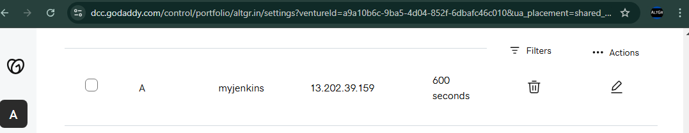
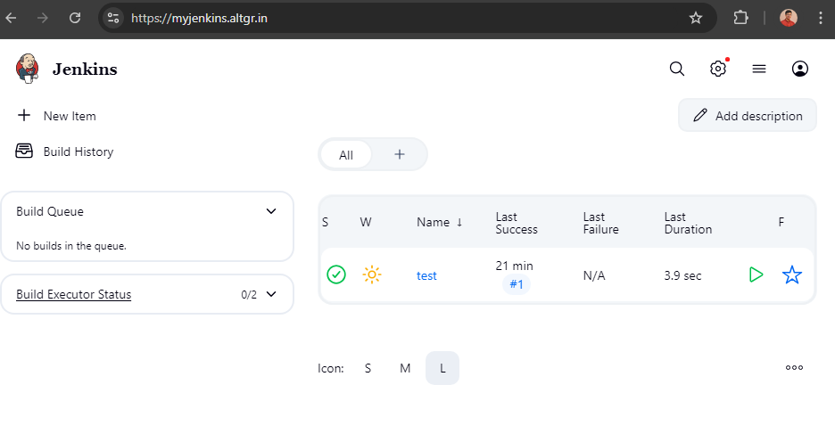

# terraform-aws-ec2-jenkins
automate installation of jenkins with ssl

this will create ubuntu 24.04 LTS EC2 instance and install jenkins version `2.516.1` LTS.

```bash
terraform apply -auto-approve
```

> **NOTE**:- need to configure subdomain with elastic ip generated as output in your domain provider(Godaddy, Route53 etc.) for Letsencrypt SSL generation followed by nginx reverse proxy configuration.

Configure Domain



Output:-




---

If still facing error try manually running ansible playbook

```bash
sudo apt update -y
sudo apt install ansible wget -y
ansible-galaxy role install moreskylab.jenkins-ssl
wget https://raw.githubusercontent.com/moreskylab/ansible-role-jenkins-ssl/refs/heads/main/test/main.yaml
ansible-playbook main.yaml
```