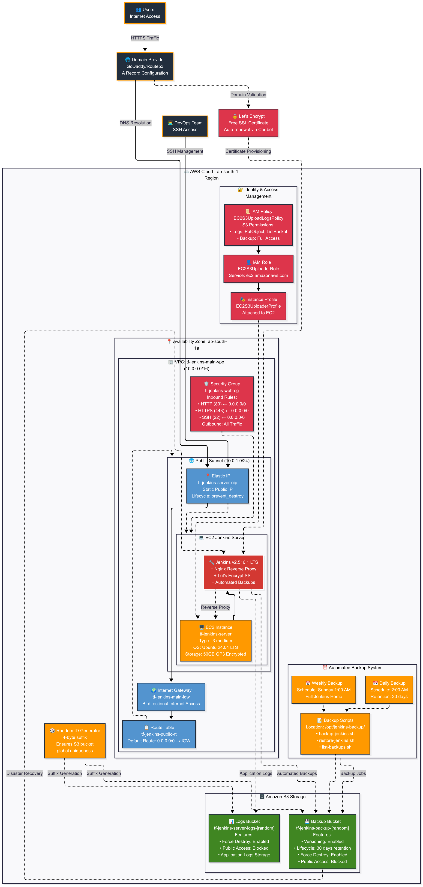

# terraform-aws-ec2-jenkins
automate installation of jenkins with ssl

this will create ubuntu 24.04 LTS EC2 instance and install jenkins version `2.516.1` LTS.

```bash
terraform apply -auto-approve
```
Output:-

```bash
Outputs:

backup_commands = {
  "list_backups" = "/opt/jenkins-backup/list-backups.sh tf-jenkins-backup-39c9eebd"
  "manual_backup" = "sudo /opt/jenkins-backup/backup-jenkins.sh tf-jenkins-backup-39c9eebd"
  "restore_example" = "sudo /opt/jenkins-backup/restore-jenkins.sh tf-jenkins-backup-39c9eebd jenkins-backup-YYYYMMDD_HHMMSS.tar.gz"
}
jenkins_backup_bucket = "tf-jenkins-backup-39c9eebd"
logs_bucket = "tf-jenkins-server-logs-39c9eebd"
web_server_eip_allocation_id = "eipalloc-00101a441271aeae8"
web_server_public_ip = "13.235.211.129"
```

To destroy the infra and skip the deletion of the elastic IP, apply the following commands.

```bash
terraform state rm aws_eip_association.web
terraform state rm aws_eip.web[0]
terraform destroy -auto-approve
```

Edit `jenkins-setup.sh` to add your domain

Example:-
```bash
# Install Jenkins using Ansible
ansible-galaxy role install moreskylab.jenkins-ssl
wget https://raw.githubusercontent.com/moreskylab/ansible-role-jenkins-ssl/refs/heads/main/test/main.yaml
ansible-playbook main.yaml -e "jenkins_domain=<YOUR_DOMAIN_NAME>"
```

> **NOTE**:- need to configure an 'A' record mapped to the elastic IP to the domain provider, e.g., GoDaddy, Route53, etc., for Let's Encrypt SSL generation, followed by nginx reverse proxy configuration with same SSL certificate.

Configure Domain


Output:-


## Architecture Diagram


